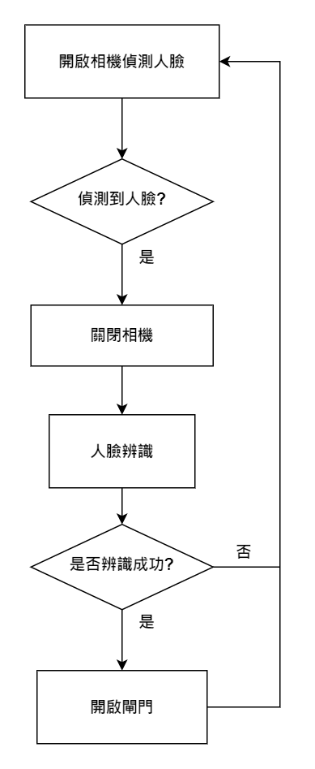

# 鑰不鑰臉──人臉辨識 Web 閘門系統  
### 目錄
>1. 專案介紹  
>2. 功能說明  
>3. 系統架構     
   

# 專案介紹
人臉辨識Web閘門系統是一套智能門禁管理系統，利用人臉辨識技術進行身份驗證，確保只有授權人員才能進入特定區域。本系統可大幅提高安全性並簡化傳統門禁卡系統的管理流程。

# 功能說明 
 - 即時人臉辨識：透過攝像頭即時掃描並比對資料庫中的人臉資料。
 - 人員管理：可新增、修改、刪除人員，此操作會被記錄在事件紀錄頁面中。
 - 訪客記錄：紀錄開門時間與人員，並記錄在事件紀錄頁面中。
 - 設置開門按鈕：如系統辨識異常，無法正常開門，開門按鈕可即時解決問題。

# 系統架構

